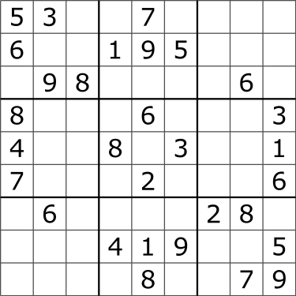
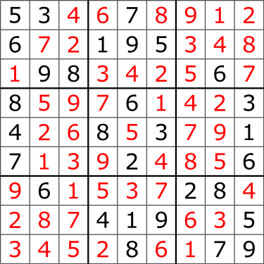
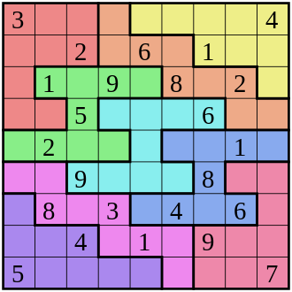
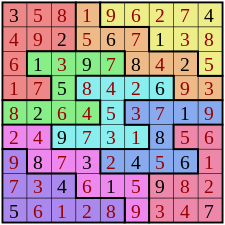

# Sudoku Solver, take 2

Another take at Sudoku solving in Rust. This is a weekend-ish remake of my previous pet project
at [sunsided/rust-sudoku-solver](https://github.com/sunsided/rust-sudoku-solver).
Unlike the previous experiment, this solver correctly solves Hypersudokus and requires fewer branches.
Internally, value candidates and indexes are encoded via 16- and 128-bit bitsets ([ValueBitSet], [IndexBitSet]),
reducing the overhead for constructing and testing hashsets.

[ValueBitSet]: src/value.rs
[IndexBitSet]: src/index.rs

To show the available options for the example, execute:

```bash
cargo run --example solver -- --help
```

To run the default example with debug output, execute:

```bash
RUST_LOG=debug cargo run --release --example solver
```

## Sudoku example

For reference, here's an example puzzle from the Wikipedia [Sudoku](https://en.wikipedia.org/wiki/Sudoku) page:

| Initial State           | Solution                  |
|-------------------------|---------------------------|
|  |  |

The solver's output is shown below. To run, execute:

```bash
$ cargo run --release --example solver -- --sudoku
```

### Cell groups

```plain
┌───┬───┬───┬───┬───┬───┬───┬───┬───┐
│ A · A · A │ B · B · B │ C · C · C │ 
├···┼···┼···┼···┼···┼···┼···┼···┼···┤
│ A · A · A │ B · B · B │ C · C · C │ 
├···┼···┼···┼···┼···┼···┼···┼···┼···┤
│ A · A · A │ B · B · B │ C · C · C │ 
├───┼───┼───┼───┼───┼───┼───┼───┼───┤
│ D · D · D │ E · E · E │ F · F · F │ 
├···┼···┼···┼···┼···┼···┼···┼···┼···┤
│ D · D · D │ E · E · E │ F · F · F │ 
├···┼···┼···┼···┼···┼···┼···┼···┼···┤
│ D · D · D │ E · E · E │ F · F · F │ 
├───┼───┼───┼───┼───┼───┼───┼───┼───┤
│ G · G · G │ H · H · H │ I · I · I │ 
├···┼···┼···┼···┼···┼···┼···┼···┼···┤
│ G · G · G │ H · H · H │ I · I · I │ 
├···┼···┼···┼···┼···┼···┼···┼···┼···┤
│ G · G · G │ H · H · H │ I · I · I │ 
└───┴───┴───┴───┴───┴───┴───┴───┴───┘
```

### Initial state

```plain
┌───────┬───────┬───────┬───────┬───────┬───────┬───────┬───────┬───────┐
│ · · · │ · · 3 │ 1 2 3 │ 1 2 3 │ · · · │ 1 2 3 │ 1 2 3 │ 1 2 3 │ 1 2 3 │
│ · 5 · │ · · · │ 4 5 6 │ 4 5 6 │ · · · │ 4 5 6 │ 4 5 6 │ 4 5 6 │ 4 5 6 │
│ · · · │ · · · │ 7 8 9 │ 7 8 9 │ 7 · · │ 7 8 9 │ 7 8 9 │ 7 8 9 │ 7 8 9 │
├───────┼───────┼───────┼───────┼───────┼───────┼───────┼───────┼───────┤
│ · · · │ 1 2 3 │ 1 2 3 │ 1 · · │ · · · │ · · · │ 1 2 3 │ 1 2 3 │ 1 2 3 │
│ · · 6 │ 4 5 6 │ 4 5 6 │ · · · │ · · · │ · 5 · │ 4 5 6 │ 4 5 6 │ 4 5 6 │
│ · · · │ 7 8 9 │ 7 8 9 │ · · · │ · · 9 │ · · · │ 7 8 9 │ 7 8 9 │ 7 8 9 │
├───────┼───────┼───────┼───────┼───────┼───────┼───────┼───────┼───────┤
│ 1 2 3 │ · · · │ · · · │ 1 2 3 │ 1 2 3 │ 1 2 3 │ 1 2 3 │ · · · │ 1 2 3 │
│ 4 5 6 │ · · · │ · · · │ 4 5 6 │ 4 5 6 │ 4 5 6 │ 4 5 6 │ · · 6 │ 4 5 6 │
│ 7 8 9 │ · · 9 │ · 8 · │ 7 8 9 │ 7 8 9 │ 7 8 9 │ 7 8 9 │ · · · │ 7 8 9 │
├───────┼───────┼───────┼───────┼───────┼───────┼───────┼───────┼───────┤
│ · · · │ 1 2 3 │ 1 2 3 │ 1 2 3 │ · · · │ 1 2 3 │ 1 2 3 │ 1 2 3 │ · · 3 │
│ · · · │ 4 5 6 │ 4 5 6 │ 4 5 6 │ · · 6 │ 4 5 6 │ 4 5 6 │ 4 5 6 │ · · · │
│ · 8 · │ 7 8 9 │ 7 8 9 │ 7 8 9 │ · · · │ 7 8 9 │ 7 8 9 │ 7 8 9 │ · · · │
├───────┼───────┼───────┼───────┼───────┼───────┼───────┼───────┼───────┤
│ · · · │ 1 2 3 │ 1 2 3 │ · · · │ 1 2 3 │ · · 3 │ 1 2 3 │ 1 2 3 │ 1 · · │
│ 4 · · │ 4 5 6 │ 4 5 6 │ · · · │ 4 5 6 │ · · · │ 4 5 6 │ 4 5 6 │ · · · │
│ · · · │ 7 8 9 │ 7 8 9 │ · 8 · │ 7 8 9 │ · · · │ 7 8 9 │ 7 8 9 │ · · · │
├───────┼───────┼───────┼───────┼───────┼───────┼───────┼───────┼───────┤
│ · · · │ 1 2 3 │ 1 2 3 │ 1 2 3 │ · 2 · │ 1 2 3 │ 1 2 3 │ 1 2 3 │ · · · │
│ · · · │ 4 5 6 │ 4 5 6 │ 4 5 6 │ · · · │ 4 5 6 │ 4 5 6 │ 4 5 6 │ · · 6 │
│ 7 · · │ 7 8 9 │ 7 8 9 │ 7 8 9 │ · · · │ 7 8 9 │ 7 8 9 │ 7 8 9 │ · · · │
├───────┼───────┼───────┼───────┼───────┼───────┼───────┼───────┼───────┤
│ 1 2 3 │ · · · │ 1 2 3 │ 1 2 3 │ 1 2 3 │ 1 2 3 │ · 2 · │ · · · │ 1 2 3 │
│ 4 5 6 │ · · 6 │ 4 5 6 │ 4 5 6 │ 4 5 6 │ 4 5 6 │ · · · │ · · · │ 4 5 6 │
│ 7 8 9 │ · · · │ 7 8 9 │ 7 8 9 │ 7 8 9 │ 7 8 9 │ · · · │ · 8 · │ 7 8 9 │
├───────┼───────┼───────┼───────┼───────┼───────┼───────┼───────┼───────┤
│ 1 2 3 │ 1 2 3 │ 1 2 3 │ · · · │ 1 · · │ · · · │ 1 2 3 │ 1 2 3 │ · · · │
│ 4 5 6 │ 4 5 6 │ 4 5 6 │ 4 · · │ · · · │ · · · │ 4 5 6 │ 4 5 6 │ · 5 · │
│ 7 8 9 │ 7 8 9 │ 7 8 9 │ · · · │ · · · │ · · 9 │ 7 8 9 │ 7 8 9 │ · · · │
├───────┼───────┼───────┼───────┼───────┼───────┼───────┼───────┼───────┤
│ 1 2 3 │ 1 2 3 │ 1 2 3 │ 1 2 3 │ · · · │ 1 2 3 │ 1 2 3 │ · · · │ · · · │
│ 4 5 6 │ 4 5 6 │ 4 5 6 │ 4 5 6 │ · · · │ 4 5 6 │ 4 5 6 │ · · · │ · · · │
│ 7 8 9 │ 7 8 9 │ 7 8 9 │ 7 8 9 │ · 8 · │ 7 8 9 │ 7 8 9 │ 7 · · │ · · 9 │
└───────┴───────┴───────┴───────┴───────┴───────┴───────┴───────┴───────┘
```

### Solution

```plain
┌───────┬───────┬───────┬───────┬───────┬───────┬───────┬───────┬───────┐
│ · · · │ · · 3 │ · · · │ · · · │ · · · │ · · · │ · · · │ 1 · · │ · 2 · │
│ · 5 · │ · · · │ 4 · · │ · · 6 │ · · · │ · · · │ · · · │ · · · │ · · · │
│ · · · │ · · · │ · · · │ · · · │ 7 · · │ · 8 · │ · · 9 │ · · · │ · · · │
├───────┼───────┼───────┼───────┼───────┼───────┼───────┼───────┼───────┤
│ · · · │ · · · │ · 2 · │ 1 · · │ · · · │ · · · │ · · 3 │ · · · │ · · · │
│ · · 6 │ · · · │ · · · │ · · · │ · · · │ · 5 · │ · · · │ 4 · · │ · · · │
│ · · · │ 7 · · │ · · · │ · · · │ · · 9 │ · · · │ · · · │ · · · │ · 8 · │
├───────┼───────┼───────┼───────┼───────┼───────┼───────┼───────┼───────┤
│ 1 · · │ · · · │ · · · │ · · 3 │ · · · │ · 2 · │ · · · │ · · · │ · · · │
│ · · · │ · · · │ · · · │ · · · │ 4 · · │ · · · │ · 5 · │ · · 6 │ · · · │
│ · · · │ · · 9 │ · 8 · │ · · · │ · · · │ · · · │ · · · │ · · · │ 7 · · │
├───────┼───────┼───────┼───────┼───────┼───────┼───────┼───────┼───────┤
│ · · · │ · · · │ · · · │ · · · │ · · · │ 1 · · │ · · · │ · 2 · │ · · 3 │
│ · · · │ · 5 · │ · · · │ · · · │ · · 6 │ · · · │ 4 · · │ · · · │ · · · │
│ · 8 · │ · · · │ · · 9 │ 7 · · │ · · · │ · · · │ · · · │ · · · │ · · · │
├───────┼───────┼───────┼───────┼───────┼───────┼───────┼───────┼───────┤
│ · · · │ · 2 · │ · · · │ · · · │ · · · │ · · 3 │ · · · │ · · · │ 1 · · │
│ 4 · · │ · · · │ · · 6 │ · · · │ · 5 · │ · · · │ · · · │ · · · │ · · · │
│ · · · │ · · · │ · · · │ · 8 · │ · · · │ · · · │ 7 · · │ · · 9 │ · · · │
├───────┼───────┼───────┼───────┼───────┼───────┼───────┼───────┼───────┤
│ · · · │ 1 · · │ · · 3 │ · · · │ · 2 · │ · · · │ · · · │ · · · │ · · · │
│ · · · │ · · · │ · · · │ · · · │ · · · │ 4 · · │ · · · │ · 5 · │ · · 6 │
│ 7 · · │ · · · │ · · · │ · · 9 │ · · · │ · · · │ · 8 · │ · · · │ · · · │
├───────┼───────┼───────┼───────┼───────┼───────┼───────┼───────┼───────┤
│ · · · │ · · · │ 1 · · │ · · · │ · · 3 │ · · · │ · 2 · │ · · · │ · · · │
│ · · · │ · · 6 │ · · · │ · 5 · │ · · · │ · · · │ · · · │ · · · │ 4 · · │
│ · · 9 │ · · · │ · · · │ · · · │ · · · │ 7 · · │ · · · │ · 8 · │ · · · │
├───────┼───────┼───────┼───────┼───────┼───────┼───────┼───────┼───────┤
│ · 2 · │ · · · │ · · · │ · · · │ 1 · · │ · · · │ · · · │ · · 3 │ · · · │
│ · · · │ · · · │ · · · │ 4 · · │ · · · │ · · · │ · · 6 │ · · · │ · 5 · │
│ · · · │ · 8 · │ 7 · · │ · · · │ · · · │ · · 9 │ · · · │ · · · │ · · · │
├───────┼───────┼───────┼───────┼───────┼───────┼───────┼───────┼───────┤
│ · · 3 │ · · · │ · · · │ · 2 · │ · · · │ · · · │ 1 · · │ · · · │ · · · │
│ · · · │ 4 · · │ · 5 · │ · · · │ · · · │ · · 6 │ · · · │ · · · │ · · · │
│ · · · │ · · · │ · · · │ · · · │ · 8 · │ · · · │ · · · │ 7 · · │ · · 9 │
└───────┴───────┴───────┴───────┴───────┴───────┴───────┴───────┴───────┘
```

## Nonomino example

For reference, here's an example Nonomino from the Wikipedia [Sudoku](https://en.wikipedia.org/wiki/Sudoku) page:

| Initial State             | Solution                           |
|---------------------------|------------------------------------|
|  |  |

The solver's output is shown below. To run, execute:

```bash
$ cargo run --release --example solver -- --nonomino
```

### Cell groups

```plain
┌───┬───┬───┬───┬───┬───┬───┬───┬───┐
│ A · A · A │ B · C · C │ C · C · C │ 
├···┼···┼···┼···┼···┼···┼···┼···┼···┤
│ A · A · A │ B · B · B │ C · C · C │ 
├···┼···┼···┼···┼···┼···┼···┼···┼···┤
│ A · D · D │ D · D · B │ B · B · C │ 
├───┼───┼───┼───┼───┼───┼───┼───┼───┤
│ A · A · D │ E · E · E │ E · B · B │ 
├···┼···┼···┼···┼···┼···┼···┼···┼···┤
│ D · D · D │ D · E · F │ F · F · F │ 
├···┼···┼···┼···┼···┼···┼···┼···┼···┤
│ G · G · E │ E · E · E │ F · I · I │ 
├───┼───┼───┼───┼───┼───┼───┼───┼───┤
│ H · G · G │ G · F · F │ F · F · I │ 
├···┼···┼···┼···┼···┼···┼···┼···┼···┤
│ H · H · H │ G · G · G │ I · I · I │ 
├···┼···┼···┼···┼···┼···┼···┼···┼···┤
│ H · H · H │ H · H · G │ I · I · I │ 
└───┴───┴───┴───┴───┴───┴───┴───┴───┘
```

### Initial state

```plain
┌───────┬───────┬───────┬───────┬───────┬───────┬───────┬───────┬───────┐
│ · · 3 │ 1 2 3 │ 1 2 3 │ 1 2 3 │ 1 2 3 │ 1 2 3 │ 1 2 3 │ 1 2 3 │ · · · │
│ · · · │ 4 5 6 │ 4 5 6 │ 4 5 6 │ 4 5 6 │ 4 5 6 │ 4 5 6 │ 4 5 6 │ 4 · · │
│ · · · │ 7 8 9 │ 7 8 9 │ 7 8 9 │ 7 8 9 │ 7 8 9 │ 7 8 9 │ 7 8 9 │ · · · │
├───────┼───────┼───────┼───────┼───────┼───────┼───────┼───────┼───────┤
│ 1 2 3 │ 1 2 3 │ · 2 · │ 1 2 3 │ · · · │ 1 2 3 │ 1 · · │ 1 2 3 │ 1 2 3 │
│ 4 5 6 │ 4 5 6 │ · · · │ 4 5 6 │ · · 6 │ 4 5 6 │ · · · │ 4 5 6 │ 4 5 6 │
│ 7 8 9 │ 7 8 9 │ · · · │ 7 8 9 │ · · · │ 7 8 9 │ · · · │ 7 8 9 │ 7 8 9 │
├───────┼───────┼───────┼───────┼───────┼───────┼───────┼───────┼───────┤
│ 1 2 3 │ 1 · · │ 1 2 3 │ · · · │ 1 2 3 │ · · · │ 1 2 3 │ · 2 · │ 1 2 3 │
│ 4 5 6 │ · · · │ 4 5 6 │ · · · │ 4 5 6 │ · · · │ 4 5 6 │ · · · │ 4 5 6 │
│ 7 8 9 │ · · · │ 7 8 9 │ · · 9 │ 7 8 9 │ · 8 · │ 7 8 9 │ · · · │ 7 8 9 │
├───────┼───────┼───────┼───────┼───────┼───────┼───────┼───────┼───────┤
│ 1 2 3 │ 1 2 3 │ · · · │ 1 2 3 │ 1 2 3 │ 1 2 3 │ · · · │ 1 2 3 │ 1 2 3 │
│ 4 5 6 │ 4 5 6 │ · 5 · │ 4 5 6 │ 4 5 6 │ 4 5 6 │ · · 6 │ 4 5 6 │ 4 5 6 │
│ 7 8 9 │ 7 8 9 │ · · · │ 7 8 9 │ 7 8 9 │ 7 8 9 │ · · · │ 7 8 9 │ 7 8 9 │
├───────┼───────┼───────┼───────┼───────┼───────┼───────┼───────┼───────┤
│ 1 2 3 │ · 2 · │ 1 2 3 │ 1 2 3 │ 1 2 3 │ 1 2 3 │ 1 2 3 │ 1 · · │ 1 2 3 │
│ 4 5 6 │ · · · │ 4 5 6 │ 4 5 6 │ 4 5 6 │ 4 5 6 │ 4 5 6 │ · · · │ 4 5 6 │
│ 7 8 9 │ · · · │ 7 8 9 │ 7 8 9 │ 7 8 9 │ 7 8 9 │ 7 8 9 │ · · · │ 7 8 9 │
├───────┼───────┼───────┼───────┼───────┼───────┼───────┼───────┼───────┤
│ 1 2 3 │ 1 2 3 │ · · · │ 1 2 3 │ 1 2 3 │ 1 2 3 │ · · · │ 1 2 3 │ 1 2 3 │
│ 4 5 6 │ 4 5 6 │ · · · │ 4 5 6 │ 4 5 6 │ 4 5 6 │ · · · │ 4 5 6 │ 4 5 6 │
│ 7 8 9 │ 7 8 9 │ · · 9 │ 7 8 9 │ 7 8 9 │ 7 8 9 │ · 8 · │ 7 8 9 │ 7 8 9 │
├───────┼───────┼───────┼───────┼───────┼───────┼───────┼───────┼───────┤
│ 1 2 3 │ · · · │ 1 2 3 │ · · 3 │ 1 2 3 │ · · · │ 1 2 3 │ · · · │ 1 2 3 │
│ 4 5 6 │ · · · │ 4 5 6 │ · · · │ 4 5 6 │ 4 · · │ 4 5 6 │ · · 6 │ 4 5 6 │
│ 7 8 9 │ · 8 · │ 7 8 9 │ · · · │ 7 8 9 │ · · · │ 7 8 9 │ · · · │ 7 8 9 │
├───────┼───────┼───────┼───────┼───────┼───────┼───────┼───────┼───────┤
│ 1 2 3 │ 1 2 3 │ · · · │ 1 2 3 │ 1 · · │ 1 2 3 │ · · · │ 1 2 3 │ 1 2 3 │
│ 4 5 6 │ 4 5 6 │ 4 · · │ 4 5 6 │ · · · │ 4 5 6 │ · · · │ 4 5 6 │ 4 5 6 │
│ 7 8 9 │ 7 8 9 │ · · · │ 7 8 9 │ · · · │ 7 8 9 │ · · 9 │ 7 8 9 │ 7 8 9 │
├───────┼───────┼───────┼───────┼───────┼───────┼───────┼───────┼───────┤
│ · · · │ 1 2 3 │ 1 2 3 │ 1 2 3 │ 1 2 3 │ 1 2 3 │ 1 2 3 │ 1 2 3 │ · · · │
│ · 5 · │ 4 5 6 │ 4 5 6 │ 4 5 6 │ 4 5 6 │ 4 5 6 │ 4 5 6 │ 4 5 6 │ · · · │
│ · · · │ 7 8 9 │ 7 8 9 │ 7 8 9 │ 7 8 9 │ 7 8 9 │ 7 8 9 │ 7 8 9 │ 7 · · │
└───────┴───────┴───────┴───────┴───────┴───────┴───────┴───────┴───────┘
```

### Solution

```plain
┌───────┬───────┬───────┬───────┬───────┬───────┬───────┬───────┬───────┐
│ · · 3 │ · · · │ · · · │ 1 · · │ · · · │ · · · │ · 2 · │ · · · │ · · · │
│ · · · │ · 5 · │ · · · │ · · · │ · · · │ · · 6 │ · · · │ · · · │ 4 · · │
│ · · · │ · · · │ · 8 · │ · · · │ · · 9 │ · · · │ · · · │ 7 · · │ · · · │
├───────┼───────┼───────┼───────┼───────┼───────┼───────┼───────┼───────┤
│ · · · │ · · · │ · 2 · │ · · · │ · · · │ · · · │ 1 · · │ · · 3 │ · · · │
│ 4 · · │ · · · │ · · · │ · 5 · │ · · 6 │ · · · │ · · · │ · · · │ · · · │
│ · · · │ · · 9 │ · · · │ · · · │ · · · │ 7 · · │ · · · │ · · · │ · 8 · │
├───────┼───────┼───────┼───────┼───────┼───────┼───────┼───────┼───────┤
│ · · · │ 1 · · │ · · 3 │ · · · │ · · · │ · · · │ · · · │ · 2 · │ · · · │
│ · · 6 │ · · · │ · · · │ · · · │ · · · │ · · · │ 4 · · │ · · · │ · 5 · │
│ · · · │ · · · │ · · · │ · · 9 │ 7 · · │ · 8 · │ · · · │ · · · │ · · · │
├───────┼───────┼───────┼───────┼───────┼───────┼───────┼───────┼───────┤
│ 1 · · │ · · · │ · · · │ · · · │ · · · │ · 2 · │ · · · │ · · · │ · · 3 │
│ · · · │ · · · │ · 5 · │ · · · │ 4 · · │ · · · │ · · 6 │ · · · │ · · · │
│ · · · │ 7 · · │ · · · │ · 8 · │ · · · │ · · · │ · · · │ · · 9 │ · · · │
├───────┼───────┼───────┼───────┼───────┼───────┼───────┼───────┼───────┤
│ · · · │ · 2 · │ · · · │ · · · │ · · · │ · · 3 │ · · · │ 1 · · │ · · · │
│ · · · │ · · · │ · · 6 │ 4 · · │ · 5 · │ · · · │ · · · │ · · · │ · · · │
│ · 8 · │ · · · │ · · · │ · · · │ · · · │ · · · │ 7 · · │ · · · │ · · 9 │
├───────┼───────┼───────┼───────┼───────┼───────┼───────┼───────┼───────┤
│ · 2 · │ · · · │ · · · │ · · · │ · · 3 │ 1 · · │ · · · │ · · · │ · · · │
│ · · · │ 4 · · │ · · · │ · · · │ · · · │ · · · │ · · · │ · 5 · │ · · 6 │
│ · · · │ · · · │ · · 9 │ 7 · · │ · · · │ · · · │ · 8 · │ · · · │ · · · │
├───────┼───────┼───────┼───────┼───────┼───────┼───────┼───────┼───────┤
│ · · · │ · · · │ · · · │ · · 3 │ · 2 · │ · · · │ · · · │ · · · │ 1 · · │
│ · · · │ · · · │ · · · │ · · · │ · · · │ 4 · · │ · 5 · │ · · 6 │ · · · │
│ · · 9 │ · 8 · │ 7 · · │ · · · │ · · · │ · · · │ · · · │ · · · │ · · · │
├───────┼───────┼───────┼───────┼───────┼───────┼───────┼───────┼───────┤
│ · · · │ · · 3 │ · · · │ · · · │ 1 · · │ · · · │ · · · │ · · · │ · 2 · │
│ · · · │ · · · │ 4 · · │ · · 6 │ · · · │ · 5 · │ · · · │ · · · │ · · · │
│ 7 · · │ · · · │ · · · │ · · · │ · · · │ · · · │ · · 9 │ · 8 · │ · · · │
├───────┼───────┼───────┼───────┼───────┼───────┼───────┼───────┼───────┤
│ · · · │ · · · │ 1 · · │ · 2 · │ · · · │ · · · │ · · 3 │ · · · │ · · · │
│ · 5 · │ · · 6 │ · · · │ · · · │ · · · │ · · · │ · · · │ 4 · · │ · · · │
│ · · · │ · · · │ · · · │ · · · │ · 8 · │ · · 9 │ · · · │ · · · │ 7 · · │
└───────┴───────┴───────┴───────┴───────┴───────┴───────┴───────┴───────┘
```

## Hypersudoku example

A Hypersudoku example. To run it, execute:

```bash
$ cargo run --release --example solver -- --hyper
```

### Initial state

```plain
┌───────┬───────┬───────┬───────┬───────┬───────┬───────┬───────┬───────┐
│ 1 2 3 │ 1 2 3 │ 1 2 3 │ 1 2 3 │ 1 2 3 │ 1 2 3 │ 1 2 3 │ 1 · · │ 1 2 3 │
│ 4 5 6 │ 4 5 6 │ 4 5 6 │ 4 5 6 │ 4 5 6 │ 4 5 6 │ 4 5 6 │ · · · │ 4 5 6 │
│ 7 8 9 │ 7 8 9 │ 7 8 9 │ 7 8 9 │ 7 8 9 │ 7 8 9 │ 7 8 9 │ · · · │ 7 8 9 │
├───────┼───────┼───────┼───────┼───────┼───────┼───────┼───────┼───────┤
│ 1 2 3 │ 1 2 3 │ · 2 · │ 1 2 3 │ 1 2 3 │ 1 2 3 │ 1 2 3 │ · · 3 │ · · · │
│ 4 5 6 │ 4 5 6 │ · · · │ 4 5 6 │ 4 5 6 │ 4 5 6 │ 4 5 6 │ · · · │ 4 · · │
│ 7 8 9 │ 7 8 9 │ · · · │ 7 8 9 │ 7 8 9 │ 7 8 9 │ 7 8 9 │ · · · │ · · · │
├───────┼───────┼───────┼───────┼───────┼───────┼───────┼───────┼───────┤
│ 1 2 3 │ 1 2 3 │ 1 2 3 │ 1 2 3 │ · · · │ 1 · · │ 1 2 3 │ 1 2 3 │ 1 2 3 │
│ 4 5 6 │ 4 5 6 │ 4 5 6 │ 4 5 6 │ · 5 · │ · · · │ 4 5 6 │ 4 5 6 │ 4 5 6 │
│ 7 8 9 │ 7 8 9 │ 7 8 9 │ 7 8 9 │ · · · │ · · · │ 7 8 9 │ 7 8 9 │ 7 8 9 │
├───────┼───────┼───────┼───────┼───────┼───────┼───────┼───────┼───────┤
│ 1 2 3 │ 1 2 3 │ 1 2 3 │ 1 2 3 │ 1 2 3 │ · · · │ · · · │ 1 2 3 │ 1 2 3 │
│ 4 5 6 │ 4 5 6 │ 4 5 6 │ 4 5 6 │ 4 5 6 │ · · 6 │ · 5 · │ 4 5 6 │ 4 5 6 │
│ 7 8 9 │ 7 8 9 │ 7 8 9 │ 7 8 9 │ 7 8 9 │ · · · │ · · · │ 7 8 9 │ 7 8 9 │
├───────┼───────┼───────┼───────┼───────┼───────┼───────┼───────┼───────┤
│ 1 2 3 │ · · · │ 1 2 3 │ · · 3 │ 1 2 3 │ 1 2 3 │ 1 2 3 │ · · · │ 1 2 3 │
│ 4 5 6 │ · · · │ 4 5 6 │ · · · │ 4 5 6 │ 4 5 6 │ 4 5 6 │ · · · │ 4 5 6 │
│ 7 8 9 │ 7 · · │ 7 8 9 │ · · · │ 7 8 9 │ 7 8 9 │ 7 8 9 │ · 8 · │ 7 8 9 │
├───────┼───────┼───────┼───────┼───────┼───────┼───────┼───────┼───────┤
│ 1 2 3 │ 1 2 3 │ · · 3 │ 1 2 3 │ 1 2 3 │ 1 2 3 │ 1 2 3 │ 1 2 3 │ 1 2 3 │
│ 4 5 6 │ 4 5 6 │ · · · │ 4 5 6 │ 4 5 6 │ 4 5 6 │ 4 5 6 │ 4 5 6 │ 4 5 6 │
│ 7 8 9 │ 7 8 9 │ · · · │ 7 8 9 │ 7 8 9 │ 7 8 9 │ 7 8 9 │ 7 8 9 │ 7 8 9 │
├───────┼───────┼───────┼───────┼───────┼───────┼───────┼───────┼───────┤
│ 1 2 3 │ 1 2 3 │ 1 2 3 │ 1 2 3 │ · · · │ 1 2 3 │ 1 2 3 │ 1 2 3 │ 1 2 3 │
│ 4 5 6 │ 4 5 6 │ 4 5 6 │ 4 5 6 │ · · · │ 4 5 6 │ 4 5 6 │ 4 5 6 │ 4 5 6 │
│ 7 8 9 │ 7 8 9 │ 7 8 9 │ 7 8 9 │ · 8 · │ 7 8 9 │ 7 8 9 │ 7 8 9 │ 7 8 9 │
├───────┼───────┼───────┼───────┼───────┼───────┼───────┼───────┼───────┤
│ · · · │ · · · │ 1 2 3 │ 1 2 3 │ 1 2 3 │ 1 2 3 │ · · · │ 1 2 3 │ 1 2 3 │
│ · 5 · │ · · · │ 4 5 6 │ 4 5 6 │ 4 5 6 │ 4 5 6 │ · · · │ 4 5 6 │ 4 5 6 │
│ · · · │ · 8 · │ 7 8 9 │ 7 8 9 │ 7 8 9 │ 7 8 9 │ · · 9 │ 7 8 9 │ 7 8 9 │
├───────┼───────┼───────┼───────┼───────┼───────┼───────┼───────┼───────┤
│ · · · │ · · · │ 1 2 3 │ 1 2 3 │ 1 2 3 │ 1 2 3 │ 1 2 3 │ 1 2 3 │ 1 2 3 │
│ · · 6 │ · · · │ 4 5 6 │ 4 5 6 │ 4 5 6 │ 4 5 6 │ 4 5 6 │ 4 5 6 │ 4 5 6 │
│ · · · │ · · 9 │ 7 8 9 │ 7 8 9 │ 7 8 9 │ 7 8 9 │ 7 8 9 │ 7 8 9 │ 7 8 9 │
└───────┴───────┴───────┴───────┴───────┴───────┴───────┴───────┴───────┘
```

### Solution

```plain
┌───────┬───────┬───────┬───────┬───────┬───────┬───────┬───────┬───────┐
│ · · · │ · · · │ · · · │ · · · │ · · 3 │ · 2 · │ · · · │ 1 · · │ · · · │
│ · · · │ 4 · · │ · · 6 │ · · · │ · · · │ · · · │ · · · │ · · · │ · 5 · │
│ · · 9 │ · · · │ · · · │ · 8 · │ · · · │ · · · │ 7 · · │ · · · │ · · · │
├───────┼───────┼───────┼───────┼───────┼───────┼───────┼───────┼───────┤
│ 1 · · │ · · · │ · 2 · │ · · · │ · · · │ · · · │ · · · │ · · 3 │ · · · │
│ · · · │ · 5 · │ · · · │ · · 6 │ · · · │ · · · │ · · · │ · · · │ 4 · · │
│ · · · │ · · · │ · · · │ · · · │ · · 9 │ 7 · · │ · 8 · │ · · · │ · · · │
├───────┼───────┼───────┼───────┼───────┼───────┼───────┼───────┼───────┤
│ · · · │ · · 3 │ · · · │ · · · │ · · · │ 1 · · │ · 2 · │ · · · │ · · · │
│ · · · │ · · · │ · · · │ 4 · · │ · 5 · │ · · · │ · · · │ · · · │ · · 6 │
│ 7 · · │ · · · │ · 8 · │ · · · │ · · · │ · · · │ · · · │ · · 9 │ · · · │
├───────┼───────┼───────┼───────┼───────┼───────┼───────┼───────┼───────┤
│ · · · │ 1 · · │ · · · │ · · · │ · 2 · │ · · · │ · · · │ · · · │ · · 3 │
│ · · · │ · · · │ · · · │ · · · │ · · · │ · · 6 │ · 5 · │ 4 · · │ · · · │
│ · 8 · │ · · · │ · · 9 │ 7 · · │ · · · │ · · · │ · · · │ · · · │ · · · │
├───────┼───────┼───────┼───────┼───────┼───────┼───────┼───────┼───────┤
│ · · · │ · · · │ · · · │ · · 3 │ 1 · · │ · · · │ · · · │ · · · │ · 2 · │
│ 4 · · │ · · · │ · 5 · │ · · · │ · · · │ · · · │ · · 6 │ · · · │ · · · │
│ · · · │ 7 · · │ · · · │ · · · │ · · · │ · · 9 │ · · · │ · 8 · │ · · · │
├───────┼───────┼───────┼───────┼───────┼───────┼───────┼───────┼───────┤
│ · 2 · │ · · · │ · · 3 │ · · · │ · · · │ · · · │ 1 · · │ · · · │ · · · │
│ · · · │ · · 6 │ · · · │ · 5 · │ 4 · · │ · · · │ · · · │ · · · │ · · · │
│ · · · │ · · · │ · · · │ · · · │ · · · │ · 8 · │ · · · │ 7 · · │ · · 9 │
├───────┼───────┼───────┼───────┼───────┼───────┼───────┼───────┼───────┤
│ · · 3 │ · 2 · │ · · · │ · · · │ · · · │ · · · │ · · · │ · · · │ 1 · · │
│ · · · │ · · · │ · · · │ · · · │ · · · │ · 5 · │ 4 · · │ · · 6 │ · · · │
│ · · · │ · · · │ 7 · · │ · · 9 │ · 8 · │ · · · │ · · · │ · · · │ · · · │
├───────┼───────┼───────┼───────┼───────┼───────┼───────┼───────┼───────┤
│ · · · │ · · · │ · · · │ 1 · · │ · · · │ · · 3 │ · · · │ · 2 · │ · · · │
│ · 5 · │ · · · │ 4 · · │ · · · │ · · 6 │ · · · │ · · · │ · · · │ · · · │
│ · · · │ · 8 · │ · · · │ · · · │ · · · │ · · · │ · · 9 │ · · · │ 7 · · │
├───────┼───────┼───────┼───────┼───────┼───────┼───────┼───────┼───────┤
│ · · · │ · · · │ 1 · · │ · 2 · │ · · · │ · · · │ · · 3 │ · · · │ · · · │
│ · · 6 │ · · · │ · · · │ · · · │ · · · │ 4 · · │ · · · │ · 5 · │ · · · │
│ · · · │ · · 9 │ · · · │ · · · │ 7 · · │ · · · │ · · · │ · · · │ · 8 · │
└───────┴───────┴───────┴───────┴───────┴───────┴───────┴───────┴───────┘
```
