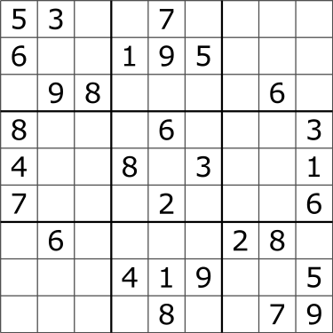
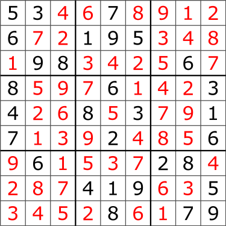
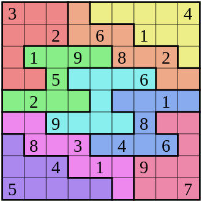
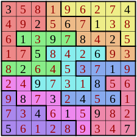

# Sudoku Solver, take 2

[](https://codecov.io/gh/sunsided/sudoku2-rs)

Another take at Sudoku solving in Rust. This is a weekend-ish remake of my previous pet project
at [sunsided/rust-sudoku-solver](https://github.com/sunsided/rust-sudoku-solver).
Unlike the previous experiment, this solver correctly solves Hypersudokus and requires fewer branches.
Internally, value candidates and indexes are encoded via 16- and 128-bit bitsets ([ValueBitSet], [IndexBitSet]),
reducing the overhead for constructing and testing hashsets.

Currently implemented strategies are [Naked Singles], [Hidden Singles], [Naked Twins], [Hidden Twins],
[Naked Triples], [Hidden Triples], [Naked Quads], [Hidden Quads], [H-Pattern], [Skyscraper], [X-Wings],
[XY-Wing] and [W-Wing].
Each additional strategy comes with its own overhead and most of the time, simply running a trial-and-error
branching strategy performs best in terms of wall clock time.

[Naked Quads] and [Hidden Quads] are **opt-in and disabled by default**.

The [Unique Rectangle] strategy (Type 1) is also available, but is **opt-in and disabled by default**.
It relies on the assumption that the puzzle has exactly one solution; running it on a board with multiple
solutions (e.g. a user-supplied or fuzz-generated puzzle that has not been validated) can silently corrupt
the solver. Enable it via `DefaultSolverConfig::unique_rectangle = true` or `--unique-rectangle` on the
example binary.

[ValueBitSet]: src/value.rs
[IndexBitSet]: src/index.rs

[Naked Singles]: src/strategies/naked_singles.rs
[Hidden Singles]: src/strategies/hidden_singles.rs
[Naked Twins]: src/strategies/naked_twins.rs
[Hidden Twins]: src/strategies/hidden_twins.rs
[Naked Triples]: src/strategies/naked_triples.rs
[Hidden Triples]: src/strategies/hidden_triples.rs
[Naked Quads]: src/strategies/naked_quads.rs
[Hidden Quads]: src/strategies/hidden_quads.rs
[H-Pattern]: src/strategies/h_pattern.rs
[Skyscraper]: src/strategies/skyscraper.rs
[X-Wings]: src/strategies/xwing.rs
[XY-Wing]: src/strategies/xy_wing.rs
[W-Wing]: src/strategies/w_wing.rs
[Unique Rectangle]: src/strategies/unique_rectangle.rs

To show the available options for the example, execute:

```bash
cargo run --example solver -- --help
```

To run the default example with debug output, execute:

```bash
RUST_LOG=debug cargo run --release --example solver
```

Individual strategies can be disabled. To run the default example without the Hidden Twins strategy, execute:

```bash
cargo run --release --example solver --no-hidden-twins
```

Set the log level to `trace` for more fine-grained information.

## WASM integration (draft)

The crate now ships an opt-in WASM interface behind the `wasm` feature.

Exposed entry points:

- `solve_puzzle(input)` for one-shot solving of Sudoku / Hypersudoku / Nonomino puzzles.
- `generate_puzzle(input)` for background-style generation (single call, no callbacks yet).

Build the web package:

```bash
task wasm:build
```

Run the demo page:

```bash
task wasm:demo
# open http://localhost:8000/web/demo.html
```

The demo is a simple smoke-test harness for request/response payloads and can be used to validate
both solving and generation in a browser.

## Sudoku example

For reference, here's an example puzzle from the Wikipedia [Sudoku](https://en.wikipedia.org/wiki/Sudoku) page:

| Initial State           | Solution                  |
|-------------------------|---------------------------|
|  |  |

The solver's output is shown below. To run, execute:

```bash
$ cargo run --release --example solver -- --sudoku
```

For the code, see [`src/example_games/sudoku.rs`](src/example_games/sudoku.rs).

Other board variations with known Hidden Twins or X-Wings are available with:

```bash
$ cargo run --release --example solver -- --sudoku-ht
$ cargo run --release --example solver -- --sudoku-xwing
$ cargo run --release --example solver -- --sudoku-hardest
```

### Cell groups

```plain
┌───┬───┬───┬───┬───┬───┬───┬───┬───┐
│ A · A · A │ B · B · B │ C · C · C │
├···┼···┼···┼···┼···┼···┼···┼···┼···┤
│ A · A · A │ B · B · B │ C · C · C │
├···┼···┼···┼···┼···┼···┼···┼···┼···┤
│ A · A · A │ B · B · B │ C · C · C │
├───┼───┼───┼───┼───┼───┼───┼───┼───┤
│ D · D · D │ E · E · E │ F · F · F │
├···┼···┼···┼···┼···┼···┼···┼···┼···┤
│ D · D · D │ E · E · E │ F · F · F │
├···┼···┼···┼···┼···┼···┼···┼···┼···┤
│ D · D · D │ E · E · E │ F · F · F │
├───┼───┼───┼───┼───┼───┼───┼───┼───┤
│ G · G · G │ H · H · H │ I · I · I │
├···┼···┼···┼···┼···┼···┼···┼···┼···┤
│ G · G · G │ H · H · H │ I · I · I │
├···┼···┼···┼···┼···┼···┼···┼···┼···┤
│ G · G · G │ H · H · H │ I · I · I │
└───┴───┴───┴───┴───┴───┴───┴───┴───┘
```

### Initial state

```plain
┌───────┬───────┬───────┬───────┬───────┬───────┬───────┬───────┬───────┐
│ · · · │ · · 3 │ 1 2 3 │ 1 2 3 │ · · · │ 1 2 3 │ 1 2 3 │ 1 2 3 │ 1 2 3 │
│ · 5 · │ · · · │ 4 5 6 │ 4 5 6 │ · · · │ 4 5 6 │ 4 5 6 │ 4 5 6 │ 4 5 6 │
│ · · · │ · · · │ 7 8 9 │ 7 8 9 │ 7 · · │ 7 8 9 │ 7 8 9 │ 7 8 9 │ 7 8 9 │
├───────┼───────┼───────┼───────┼───────┼───────┼───────┼───────┼───────┤
│ · · · │ 1 2 3 │ 1 2 3 │ 1 · · │ · · · │ · · · │ 1 2 3 │ 1 2 3 │ 1 2 3 │
│ · · 6 │ 4 5 6 │ 4 5 6 │ · · · │ · · · │ · 5 · │ 4 5 6 │ 4 5 6 │ 4 5 6 │
│ · · · │ 7 8 9 │ 7 8 9 │ · · · │ · · 9 │ · · · │ 7 8 9 │ 7 8 9 │ 7 8 9 │
├───────┼───────┼───────┼───────┼───────┼───────┼───────┼───────┼───────┤
│ 1 2 3 │ · · · │ · · · │ 1 2 3 │ 1 2 3 │ 1 2 3 │ 1 2 3 │ · · · │ 1 2 3 │
│ 4 5 6 │ · · · │ · · · │ 4 5 6 │ 4 5 6 │ 4 5 6 │ 4 5 6 │ · · 6 │ 4 5 6 │
│ 7 8 9 │ · · 9 │ · 8 · │ 7 8 9 │ 7 8 9 │ 7 8 9 │ 7 8 9 │ · · · │ 7 8 9 │
├───────┼───────┼───────┼───────┼───────┼───────┼───────┼───────┼───────┤
│ · · · │ 1 2 3 │ 1 2 3 │ 1 2 3 │ · · · │ 1 2 3 │ 1 2 3 │ 1 2 3 │ · · 3 │
│ · · · │ 4 5 6 │ 4 5 6 │ 4 5 6 │ · · 6 │ 4 5 6 │ 4 5 6 │ 4 5 6 │ · · · │
│ · 8 · │ 7 8 9 │ 7 8 9 │ 7 8 9 │ · · · │ 7 8 9 │ 7 8 9 │ 7 8 9 │ · · · │
├───────┼───────┼───────┼───────┼───────┼───────┼───────┼───────┼───────┤
│ · · · │ 1 2 3 │ 1 2 3 │ · · · │ 1 2 3 │ · · 3 │ 1 2 3 │ 1 2 3 │ 1 · · │
│ 4 · · │ 4 5 6 │ 4 5 6 │ · · · │ 4 5 6 │ · · · │ 4 5 6 │ 4 5 6 │ · · · │
│ · · · │ 7 8 9 │ 7 8 9 │ · 8 · │ 7 8 9 │ · · · │ 7 8 9 │ 7 8 9 │ · · · │
├───────┼───────┼───────┼───────┼───────┼───────┼───────┼───────┼───────┤
│ · · · │ 1 2 3 │ 1 2 3 │ 1 2 3 │ · 2 · │ 1 2 3 │ 1 2 3 │ 1 2 3 │ · · · │
│ · · · │ 4 5 6 │ 4 5 6 │ 4 5 6 │ · · · │ 4 5 6 │ 4 5 6 │ 4 5 6 │ · · 6 │
│ 7 · · │ 7 8 9 │ 7 8 9 │ 7 8 9 │ · · · │ 7 8 9 │ 7 8 9 │ 7 8 9 │ · · · │
├───────┼───────┼───────┼───────┼───────┼───────┼───────┼───────┼───────┤
│ 1 2 3 │ · · · │ 1 2 3 │ 1 2 3 │ 1 2 3 │ 1 2 3 │ · 2 · │ · · · │ 1 2 3 │
│ 4 5 6 │ · · 6 │ 4 5 6 │ 4 5 6 │ 4 5 6 │ 4 5 6 │ · · · │ · · · │ 4 5 6 │
│ 7 8 9 │ · · · │ 7 8 9 │ 7 8 9 │ 7 8 9 │ 7 8 9 │ · · · │ · 8 · │ 7 8 9 │
├───────┼───────┼───────┼───────┼───────┼───────┼───────┼───────┼───────┤
│ 1 2 3 │ 1 2 3 │ 1 2 3 │ · · · │ 1 · · │ · · · │ 1 2 3 │ 1 2 3 │ · · · │
│ 4 5 6 │ 4 5 6 │ 4 5 6 │ 4 · · │ · · · │ · · · │ 4 5 6 │ 4 5 6 │ · 5 · │
│ 7 8 9 │ 7 8 9 │ 7 8 9 │ · · · │ · · · │ · · 9 │ 7 8 9 │ 7 8 9 │ · · · │
├───────┼───────┼───────┼───────┼───────┼───────┼───────┼───────┼───────┤
│ 1 2 3 │ 1 2 3 │ 1 2 3 │ 1 2 3 │ · · · │ 1 2 3 │ 1 2 3 │ · · · │ · · · │
│ 4 5 6 │ 4 5 6 │ 4 5 6 │ 4 5 6 │ · · · │ 4 5 6 │ 4 5 6 │ · · · │ · · · │
│ 7 8 9 │ 7 8 9 │ 7 8 9 │ 7 8 9 │ · 8 · │ 7 8 9 │ 7 8 9 │ 7 · · │ · · 9 │
└───────┴───────┴───────┴───────┴───────┴───────┴───────┴───────┴───────┘
```

### Solution

```plain
┌───────┬───────┬───────┬───────┬───────┬───────┬───────┬───────┬───────┐
│ · · · │ · · 3 │ · · · │ · · · │ · · · │ · · · │ · · · │ 1 · · │ · 2 · │
│ · 5 · │ · · · │ 4 · · │ · · 6 │ · · · │ · · · │ · · · │ · · · │ · · · │
│ · · · │ · · · │ · · · │ · · · │ 7 · · │ · 8 · │ · · 9 │ · · · │ · · · │
├───────┼───────┼───────┼───────┼───────┼───────┼───────┼───────┼───────┤
│ · · · │ · · · │ · 2 · │ 1 · · │ · · · │ · · · │ · · 3 │ · · · │ · · · │
│ · · 6 │ · · · │ · · · │ · · · │ · · · │ · 5 · │ · · · │ 4 · · │ · · · │
│ · · · │ 7 · · │ · · · │ · · · │ · · 9 │ · · · │ · · · │ · · · │ · 8 · │
├───────┼───────┼───────┼───────┼───────┼───────┼───────┼───────┼───────┤
│ 1 · · │ · · · │ · · · │ · · 3 │ · · · │ · 2 · │ · · · │ · · · │ · · · │
│ · · · │ · · · │ · · · │ · · · │ 4 · · │ · · · │ · 5 · │ · · 6 │ · · · │
│ · · · │ · · 9 │ · 8 · │ · · · │ · · · │ · · · │ · · · │ · · · │ 7 · · │
├───────┼───────┼───────┼───────┼───────┼───────┼───────┼───────┼───────┤
│ · · · │ · · · │ · · · │ · · · │ · · · │ 1 · · │ · · · │ · 2 · │ · · 3 │
│ · · · │ · 5 · │ · · · │ · · · │ · · 6 │ · · · │ 4 · · │ · · · │ · · · │
│ · 8 · │ · · · │ · · 9 │ 7 · · │ · · · │ · · · │ · · · │ · · · │ · · · │
├───────┼───────┼───────┼───────┼───────┼───────┼───────┼───────┼───────┤
│ · · · │ · 2 · │ · · · │ · · · │ · · · │ · · 3 │ · · · │ · · · │ 1 · · │
│ 4 · · │ · · · │ · · 6 │ · · · │ · 5 · │ · · · │ · · · │ · · · │ · · · │
│ · · · │ · · · │ · · · │ · 8 · │ · · · │ · · · │ 7 · · │ · · 9 │ · · · │
├───────┼───────┼───────┼───────┼───────┼───────┼───────┼───────┼───────┤
│ · · · │ 1 · · │ · · 3 │ · · · │ · 2 · │ · · · │ · · · │ · · · │ · · · │
│ · · · │ · · · │ · · · │ · · · │ · · · │ 4 · · │ · · · │ · 5 · │ · · 6 │
│ 7 · · │ · · · │ · · · │ · · 9 │ · · · │ · · · │ · 8 · │ · · · │ · · · │
├───────┼───────┼───────┼───────┼───────┼───────┼───────┼───────┼───────┤
│ · · · │ · · · │ 1 · · │ · · · │ · · 3 │ · · · │ · 2 · │ · · · │ · · · │
│ · · · │ · · 6 │ · · · │ · 5 · │ · · · │ · · · │ · · · │ · · · │ 4 · · │
│ · · 9 │ · · · │ · · · │ · · · │ · · · │ 7 · · │ · · · │ · 8 · │ · · · │
├───────┼───────┼───────┼───────┼───────┼───────┼───────┼───────┼───────┤
│ · 2 · │ · · · │ · · · │ · · · │ 1 · · │ · · · │ · · · │ · · 3 │ · · · │
│ · · · │ · · · │ · · · │ 4 · · │ · · · │ · · · │ · · 6 │ · · · │ · 5 · │
│ · · · │ · 8 · │ 7 · · │ · · · │ · · · │ · · 9 │ · · · │ · · · │ · · · │
├───────┼───────┼───────┼───────┼───────┼───────┼───────┼───────┼───────┤
│ · · 3 │ · · · │ · · · │ · 2 · │ · · · │ · · · │ 1 · · │ · · · │ · · · │
│ · · · │ 4 · · │ · 5 · │ · · · │ · · · │ · · 6 │ · · · │ · · · │ · · · │
│ · · · │ · · · │ · · · │ · · · │ · 8 · │ · · · │ · · · │ 7 · · │ · · 9 │
└───────┴───────┴───────┴───────┴───────┴───────┴───────┴───────┴───────┘
```

## Nonomino example

For reference, here's an example Nonomino from the Wikipedia [Sudoku](https://en.wikipedia.org/wiki/Sudoku) page:

| Initial State             | Solution                           |
|---------------------------|------------------------------------|
|  |  |

The solver's output is shown below. To run, execute:

```bash
$ cargo run --release --example solver -- --nonomino
```

For the code, see [`src/example_games/nonomino.rs`](src/example_games/nonomino.rs).

### Cell groups

```plain
┌───┬───┬───┬───┬───┬───┬───┬───┬───┐
│ A · A · A │ B · C · C │ C · C · C │
├···┼···┼···┼···┼···┼···┼···┼···┼···┤
│ A · A · A │ B · B · B │ C · C · C │
├···┼···┼···┼···┼···┼···┼···┼···┼···┤
│ A · D · D │ D · D · B │ B · B · C │
├───┼───┼───┼───┼───┼───┼───┼───┼───┤
│ A · A · D │ E · E · E │ E · B · B │
├···┼···┼···┼···┼···┼···┼···┼···┼···┤
│ D · D · D │ D · E · F │ F · F · F │
├···┼···┼···┼···┼···┼···┼···┼···┼···┤
│ G · G · E │ E · E · E │ F · I · I │
├───┼───┼───┼───┼───┼───┼───┼───┼───┤
│ H · G · G │ G · F · F │ F · F · I │
├···┼···┼···┼···┼···┼···┼···┼···┼···┤
│ H · H · H │ G · G · G │ I · I · I │
├···┼···┼···┼···┼···┼···┼···┼···┼···┤
│ H · H · H │ H · H · G │ I · I · I │
└───┴───┴───┴───┴───┴───┴───┴───┴───┘
```

### Initial state

```plain
┌───────┬───────┬───────┬───────┬───────┬───────┬───────┬───────┬───────┐
│ · · 3 │ 1 2 3 │ 1 2 3 │ 1 2 3 │ 1 2 3 │ 1 2 3 │ 1 2 3 │ 1 2 3 │ · · · │
│ · · · │ 4 5 6 │ 4 5 6 │ 4 5 6 │ 4 5 6 │ 4 5 6 │ 4 5 6 │ 4 5 6 │ 4 · · │
│ · · · │ 7 8 9 │ 7 8 9 │ 7 8 9 │ 7 8 9 │ 7 8 9 │ 7 8 9 │ 7 8 9 │ · · · │
├───────┼───────┼───────┼───────┼───────┼───────┼───────┼───────┼───────┤
│ 1 2 3 │ 1 2 3 │ · 2 · │ 1 2 3 │ · · · │ 1 2 3 │ 1 · · │ 1 2 3 │ 1 2 3 │
│ 4 5 6 │ 4 5 6 │ · · · │ 4 5 6 │ · · 6 │ 4 5 6 │ · · · │ 4 5 6 │ 4 5 6 │
│ 7 8 9 │ 7 8 9 │ · · · │ 7 8 9 │ · · · │ 7 8 9 │ · · · │ 7 8 9 │ 7 8 9 │
├───────┼───────┼───────┼───────┼───────┼───────┼───────┼───────┼───────┤
│ 1 2 3 │ 1 · · │ 1 2 3 │ · · · │ 1 2 3 │ · · · │ 1 2 3 │ · 2 · │ 1 2 3 │
│ 4 5 6 │ · · · │ 4 5 6 │ · · · │ 4 5 6 │ · · · │ 4 5 6 │ · · · │ 4 5 6 │
│ 7 8 9 │ · · · │ 7 8 9 │ · · 9 │ 7 8 9 │ · 8 · │ 7 8 9 │ · · · │ 7 8 9 │
├───────┼───────┼───────┼───────┼───────┼───────┼───────┼───────┼───────┤
│ 1 2 3 │ 1 2 3 │ · · · │ 1 2 3 │ 1 2 3 │ 1 2 3 │ · · · │ 1 2 3 │ 1 2 3 │
│ 4 5 6 │ 4 5 6 │ · 5 · │ 4 5 6 │ 4 5 6 │ 4 5 6 │ · · 6 │ 4 5 6 │ 4 5 6 │
│ 7 8 9 │ 7 8 9 │ · · · │ 7 8 9 │ 7 8 9 │ 7 8 9 │ · · · │ 7 8 9 │ 7 8 9 │
├───────┼───────┼───────┼───────┼───────┼───────┼───────┼───────┼───────┤
│ 1 2 3 │ · 2 · │ 1 2 3 │ 1 2 3 │ 1 2 3 │ 1 2 3 │ 1 2 3 │ 1 · · │ 1 2 3 │
│ 4 5 6 │ · · · │ 4 5 6 │ 4 5 6 │ 4 5 6 │ 4 5 6 │ 4 5 6 │ · · · │ 4 5 6 │
│ 7 8 9 │ · · · │ 7 8 9 │ 7 8 9 │ 7 8 9 │ 7 8 9 │ 7 8 9 │ · · · │ 7 8 9 │
├───────┼───────┼───────┼───────┼───────┼───────┼───────┼───────┼───────┤
│ 1 2 3 │ 1 2 3 │ · · · │ 1 2 3 │ 1 2 3 │ 1 2 3 │ · · · │ 1 2 3 │ 1 2 3 │
│ 4 5 6 │ 4 5 6 │ · · · │ 4 5 6 │ 4 5 6 │ 4 5 6 │ · · · │ 4 5 6 │ 4 5 6 │
│ 7 8 9 │ 7 8 9 │ · · 9 │ 7 8 9 │ 7 8 9 │ 7 8 9 │ · 8 · │ 7 8 9 │ 7 8 9 │
├───────┼───────┼───────┼───────┼───────┼───────┼───────┼───────┼───────┤
│ 1 2 3 │ · · · │ 1 2 3 │ · · 3 │ 1 2 3 │ · · · │ 1 2 3 │ · · · │ 1 2 3 │
│ 4 5 6 │ · · · │ 4 5 6 │ · · · │ 4 5 6 │ 4 · · │ 4 5 6 │ · · 6 │ 4 5 6 │
│ 7 8 9 │ · 8 · │ 7 8 9 │ · · · │ 7 8 9 │ · · · │ 7 8 9 │ · · · │ 7 8 9 │
├───────┼───────┼───────┼───────┼───────┼───────┼───────┼───────┼───────┤
│ 1 2 3 │ 1 2 3 │ · · · │ 1 2 3 │ 1 · · │ 1 2 3 │ · · · │ 1 2 3 │ 1 2 3 │
│ 4 5 6 │ 4 5 6 │ 4 · · │ 4 5 6 │ · · · │ 4 5 6 │ · · · │ 4 5 6 │ 4 5 6 │
│ 7 8 9 │ 7 8 9 │ · · · │ 7 8 9 │ · · · │ 7 8 9 │ · · 9 │ 7 8 9 │ 7 8 9 │
├───────┼───────┼───────┼───────┼───────┼───────┼───────┼───────┼───────┤
│ · · · │ 1 2 3 │ 1 2 3 │ 1 2 3 │ 1 2 3 │ 1 2 3 │ 1 2 3 │ 1 2 3 │ · · · │
│ · 5 · │ 4 5 6 │ 4 5 6 │ 4 5 6 │ 4 5 6 │ 4 5 6 │ 4 5 6 │ 4 5 6 │ · · · │
│ · · · │ 7 8 9 │ 7 8 9 │ 7 8 9 │ 7 8 9 │ 7 8 9 │ 7 8 9 │ 7 8 9 │ 7 · · │
└───────┴───────┴───────┴───────┴───────┴───────┴───────┴───────┴───────┘
```

### Solution

```plain
┌───────┬───────┬───────┬───────┬───────┬───────┬───────┬───────┬───────┐
│ · · 3 │ · · · │ · · · │ 1 · · │ · · · │ · · · │ · 2 · │ · · · │ · · · │
│ · · · │ · 5 · │ · · · │ · · · │ · · · │ · · 6 │ · · · │ · · · │ 4 · · │
│ · · · │ · · · │ · 8 · │ · · · │ · · 9 │ · · · │ · · · │ 7 · · │ · · · │
├───────┼───────┼───────┼───────┼───────┼───────┼───────┼───────┼───────┤
│ · · · │ · · · │ · 2 · │ · · · │ · · · │ · · · │ 1 · · │ · · 3 │ · · · │
│ 4 · · │ · · · │ · · · │ · 5 · │ · · 6 │ · · · │ · · · │ · · · │ · · · │
│ · · · │ · · 9 │ · · · │ · · · │ · · · │ 7 · · │ · · · │ · · · │ · 8 · │
├───────┼───────┼───────┼───────┼───────┼───────┼───────┼───────┼───────┤
│ · · · │ 1 · · │ · · 3 │ · · · │ · · · │ · · · │ · · · │ · 2 · │ · · · │
│ · · 6 │ · · · │ · · · │ · · · │ · · · │ · · · │ 4 · · │ · · · │ · 5 · │
│ · · · │ · · · │ · · · │ · · 9 │ 7 · · │ · 8 · │ · · · │ · · · │ · · · │
├───────┼───────┼───────┼───────┼───────┼───────┼───────┼───────┼───────┤
│ 1 · · │ · · · │ · · · │ · · · │ · · · │ · 2 · │ · · · │ · · · │ · · 3 │
│ · · · │ · · · │ · 5 · │ · · · │ 4 · · │ · · · │ · · 6 │ · · · │ · · · │
│ · · · │ 7 · · │ · · · │ · 8 · │ · · · │ · · · │ · · · │ · · 9 │ · · · │
├───────┼───────┼───────┼───────┼───────┼───────┼───────┼───────┼───────┤
│ · · · │ · 2 · │ · · · │ · · · │ · · · │ · · 3 │ · · · │ 1 · · │ · · · │
│ · · · │ · · · │ · · 6 │ 4 · · │ · 5 · │ · · · │ · · · │ · · · │ · · · │
│ · 8 · │ · · · │ · · · │ · · · │ · · · │ · · · │ 7 · · │ · · · │ · · 9 │
├───────┼───────┼───────┼───────┼───────┼───────┼───────┼───────┼───────┤
│ · 2 · │ · · · │ · · · │ · · · │ · · 3 │ 1 · · │ · · · │ · · · │ · · · │
│ · · · │ 4 · · │ · · · │ · · · │ · · · │ · · · │ · · · │ · 5 · │ · · 6 │
│ · · · │ · · · │ · · 9 │ 7 · · │ · · · │ · · · │ · 8 · │ · · · │ · · · │
├───────┼───────┼───────┼───────┼───────┼───────┼───────┼───────┼───────┤
│ · · · │ · · · │ · · · │ · · 3 │ · 2 · │ · · · │ · · · │ · · · │ 1 · · │
│ · · · │ · · · │ · · · │ · · · │ · · · │ 4 · · │ · 5 · │ · · 6 │ · · · │
│ · · 9 │ · 8 · │ 7 · · │ · · · │ · · · │ · · · │ · · · │ · · · │ · · · │
├───────┼───────┼───────┼───────┼───────┼───────┼───────┼───────┼───────┤
│ · · · │ · · 3 │ · · · │ · · · │ 1 · · │ · · · │ · · · │ · · · │ · 2 · │
│ · · · │ · · · │ 4 · · │ · · 6 │ · · · │ · 5 · │ · · · │ · · · │ · · · │
│ 7 · · │ · · · │ · · · │ · · · │ · · · │ · · · │ · · 9 │ · 8 · │ · · · │
├───────┼───────┼───────┼───────┼───────┼───────┼───────┼───────┼───────┤
│ · · · │ · · · │ 1 · · │ · 2 · │ · · · │ · · · │ · · 3 │ · · · │ · · · │
│ · 5 · │ · · 6 │ · · · │ · · · │ · · · │ · · · │ · · · │ 4 · · │ · · · │
│ · · · │ · · · │ · · · │ · · · │ · 8 · │ · · 9 │ · · · │ · · · │ 7 · · │
└───────┴───────┴───────┴───────┴───────┴───────┴───────┴───────┴───────┘
```

## Hypersudoku example

A Hypersudoku example. To run it, execute:

```bash
$ cargo run --release --example solver -- --hyper
```

For the code, see [`src/example_games/hypersudoku.rs`](src/example_games/hypersudoku.rs).

### Initial state

```plain
┌───────┬───────┬───────┬───────┬───────┬───────┬───────┬───────┬───────┐
│ 1 2 3 │ 1 2 3 │ 1 2 3 │ 1 2 3 │ 1 2 3 │ 1 2 3 │ 1 2 3 │ 1 · · │ 1 2 3 │
│ 4 5 6 │ 4 5 6 │ 4 5 6 │ 4 5 6 │ 4 5 6 │ 4 5 6 │ 4 5 6 │ · · · │ 4 5 6 │
│ 7 8 9 │ 7 8 9 │ 7 8 9 │ 7 8 9 │ 7 8 9 │ 7 8 9 │ 7 8 9 │ · · · │ 7 8 9 │
├───────┼───────┼───────┼───────┼───────┼───────┼───────┼───────┼───────┤
│ 1 2 3 │ 1 2 3 │ · 2 · │ 1 2 3 │ 1 2 3 │ 1 2 3 │ 1 2 3 │ · · 3 │ · · · │
│ 4 5 6 │ 4 5 6 │ · · · │ 4 5 6 │ 4 5 6 │ 4 5 6 │ 4 5 6 │ · · · │ 4 · · │
│ 7 8 9 │ 7 8 9 │ · · · │ 7 8 9 │ 7 8 9 │ 7 8 9 │ 7 8 9 │ · · · │ · · · │
├───────┼───────┼───────┼───────┼───────┼───────┼───────┼───────┼───────┤
│ 1 2 3 │ 1 2 3 │ 1 2 3 │ 1 2 3 │ · · · │ 1 · · │ 1 2 3 │ 1 2 3 │ 1 2 3 │
│ 4 5 6 │ 4 5 6 │ 4 5 6 │ 4 5 6 │ · 5 · │ · · · │ 4 5 6 │ 4 5 6 │ 4 5 6 │
│ 7 8 9 │ 7 8 9 │ 7 8 9 │ 7 8 9 │ · · · │ · · · │ 7 8 9 │ 7 8 9 │ 7 8 9 │
├───────┼───────┼───────┼───────┼───────┼───────┼───────┼───────┼───────┤
│ 1 2 3 │ 1 2 3 │ 1 2 3 │ 1 2 3 │ 1 2 3 │ · · · │ · · · │ 1 2 3 │ 1 2 3 │
│ 4 5 6 │ 4 5 6 │ 4 5 6 │ 4 5 6 │ 4 5 6 │ · · 6 │ · 5 · │ 4 5 6 │ 4 5 6 │
│ 7 8 9 │ 7 8 9 │ 7 8 9 │ 7 8 9 │ 7 8 9 │ · · · │ · · · │ 7 8 9 │ 7 8 9 │
├───────┼───────┼───────┼───────┼───────┼───────┼───────┼───────┼───────┤
│ 1 2 3 │ · · · │ 1 2 3 │ · · 3 │ 1 2 3 │ 1 2 3 │ 1 2 3 │ · · · │ 1 2 3 │
│ 4 5 6 │ · · · │ 4 5 6 │ · · · │ 4 5 6 │ 4 5 6 │ 4 5 6 │ · · · │ 4 5 6 │
│ 7 8 9 │ 7 · · │ 7 8 9 │ · · · │ 7 8 9 │ 7 8 9 │ 7 8 9 │ · 8 · │ 7 8 9 │
├───────┼───────┼───────┼───────┼───────┼───────┼───────┼───────┼───────┤
│ 1 2 3 │ 1 2 3 │ · · 3 │ 1 2 3 │ 1 2 3 │ 1 2 3 │ 1 2 3 │ 1 2 3 │ 1 2 3 │
│ 4 5 6 │ 4 5 6 │ · · · │ 4 5 6 │ 4 5 6 │ 4 5 6 │ 4 5 6 │ 4 5 6 │ 4 5 6 │
│ 7 8 9 │ 7 8 9 │ · · · │ 7 8 9 │ 7 8 9 │ 7 8 9 │ 7 8 9 │ 7 8 9 │ 7 8 9 │
├───────┼───────┼───────┼───────┼───────┼───────┼───────┼───────┼───────┤
│ 1 2 3 │ 1 2 3 │ 1 2 3 │ 1 2 3 │ · · · │ 1 2 3 │ 1 2 3 │ 1 2 3 │ 1 2 3 │
│ 4 5 6 │ 4 5 6 │ 4 5 6 │ 4 5 6 │ · · · │ 4 5 6 │ 4 5 6 │ 4 5 6 │ 4 5 6 │
│ 7 8 9 │ 7 8 9 │ 7 8 9 │ 7 8 9 │ · 8 · │ 7 8 9 │ 7 8 9 │ 7 8 9 │ 7 8 9 │
├───────┼───────┼───────┼───────┼───────┼───────┼───────┼───────┼───────┤
│ · · · │ · · · │ 1 2 3 │ 1 2 3 │ 1 2 3 │ 1 2 3 │ · · · │ 1 2 3 │ 1 2 3 │
│ · 5 · │ · · · │ 4 5 6 │ 4 5 6 │ 4 5 6 │ 4 5 6 │ · · · │ 4 5 6 │ 4 5 6 │
│ · · · │ · 8 · │ 7 8 9 │ 7 8 9 │ 7 8 9 │ 7 8 9 │ · · 9 │ 7 8 9 │ 7 8 9 │
├───────┼───────┼───────┼───────┼───────┼───────┼───────┼───────┼───────┤
│ · · · │ · · · │ 1 2 3 │ 1 2 3 │ 1 2 3 │ 1 2 3 │ 1 2 3 │ 1 2 3 │ 1 2 3 │
│ · · 6 │ · · · │ 4 5 6 │ 4 5 6 │ 4 5 6 │ 4 5 6 │ 4 5 6 │ 4 5 6 │ 4 5 6 │
│ · · · │ · · 9 │ 7 8 9 │ 7 8 9 │ 7 8 9 │ 7 8 9 │ 7 8 9 │ 7 8 9 │ 7 8 9 │
└───────┴───────┴───────┴───────┴───────┴───────┴───────┴───────┴───────┘
```

### Solution

```plain
┌───────┬───────┬───────┬───────┬───────┬───────┬───────┬───────┬───────┐
│ · · · │ · · · │ · · · │ · · · │ · · 3 │ · 2 · │ · · · │ 1 · · │ · · · │
│ · · · │ 4 · · │ · · 6 │ · · · │ · · · │ · · · │ · · · │ · · · │ · 5 · │
│ · · 9 │ · · · │ · · · │ · 8 · │ · · · │ · · · │ 7 · · │ · · · │ · · · │
├───────┼───────┼───────┼───────┼───────┼───────┼───────┼───────┼───────┤
│ 1 · · │ · · · │ · 2 · │ · · · │ · · · │ · · · │ · · · │ · · 3 │ · · · │
│ · · · │ · 5 · │ · · · │ · · 6 │ · · · │ · · · │ · · · │ · · · │ 4 · · │
│ · · · │ · · · │ · · · │ · · · │ · · 9 │ 7 · · │ · 8 · │ · · · │ · · · │
├───────┼───────┼───────┼───────┼───────┼───────┼───────┼───────┼───────┤
│ · · · │ · · 3 │ · · · │ · · · │ · · · │ 1 · · │ · 2 · │ · · · │ · · · │
│ · · · │ · · · │ · · · │ 4 · · │ · 5 · │ · · · │ · · · │ · · · │ · · 6 │
│ 7 · · │ · · · │ · 8 · │ · · · │ · · · │ · · · │ · · · │ · · 9 │ · · · │
├───────┼───────┼───────┼───────┼───────┼───────┼───────┼───────┼───────┤
│ · · · │ 1 · · │ · · · │ · · · │ · 2 · │ · · · │ · · · │ · · · │ · · 3 │
│ · · · │ · · · │ · · · │ · · · │ · · · │ · · 6 │ · 5 · │ 4 · · │ · · · │
│ · 8 · │ · · · │ · · 9 │ 7 · · │ · · · │ · · · │ · · · │ · · · │ · · · │
├───────┼───────┼───────┼───────┼───────┼───────┼───────┼───────┼───────┤
│ · · · │ · · · │ · · · │ · · 3 │ 1 · · │ · · · │ · · · │ · · · │ · 2 · │
│ 4 · · │ · · · │ · 5 · │ · · · │ · · · │ · · · │ · · 6 │ · · · │ · · · │
│ · · · │ 7 · · │ · · · │ · · · │ · · · │ · · 9 │ · · · │ · 8 · │ · · · │
├───────┼───────┼───────┼───────┼───────┼───────┼───────┼───────┼───────┤
│ · 2 · │ · · · │ · · 3 │ · · · │ · · · │ · · · │ 1 · · │ · · · │ · · · │
│ · · · │ · · 6 │ · · · │ · 5 · │ 4 · · │ · · · │ · · · │ · · · │ · · · │
│ · · · │ · · · │ · · · │ · · · │ · · · │ · 8 · │ · · · │ 7 · · │ · · 9 │
├───────┼───────┼───────┼───────┼───────┼───────┼───────┼───────┼───────┤
│ · · 3 │ · 2 · │ · · · │ · · · │ · · · │ · · · │ · · · │ · · · │ 1 · · │
│ · · · │ · · · │ · · · │ · · · │ · · · │ · 5 · │ 4 · · │ · · 6 │ · · · │
│ · · · │ · · · │ 7 · · │ · · 9 │ · 8 · │ · · · │ · · · │ · · · │ · · · │
├───────┼───────┼───────┼───────┼───────┼───────┼───────┼───────┼───────┤
│ · · · │ · · · │ · · · │ 1 · · │ · · · │ · · 3 │ · · · │ · 2 · │ · · · │
│ · 5 · │ · · · │ 4 · · │ · · · │ · · 6 │ · · · │ · · · │ · · · │ · · · │
│ · · · │ · 8 · │ · · · │ · · · │ · · · │ · · · │ · · 9 │ · · · │ 7 · · │
├───────┼───────┼───────┼───────┼───────┼───────┼───────┼───────┼───────┤
│ · · · │ · · · │ 1 · · │ · 2 · │ · · · │ · · · │ · · 3 │ · · · │ · · · │
│ · · 6 │ · · · │ · · · │ · · · │ · · · │ 4 · · │ · · · │ · 5 · │ · · · │
│ · · · │ · · 9 │ · · · │ · · · │ 7 · · │ · · · │ · · · │ · · · │ · 8 · │
└───────┴───────┴───────┴───────┴───────┴───────┴───────┴───────┴───────┘
```
